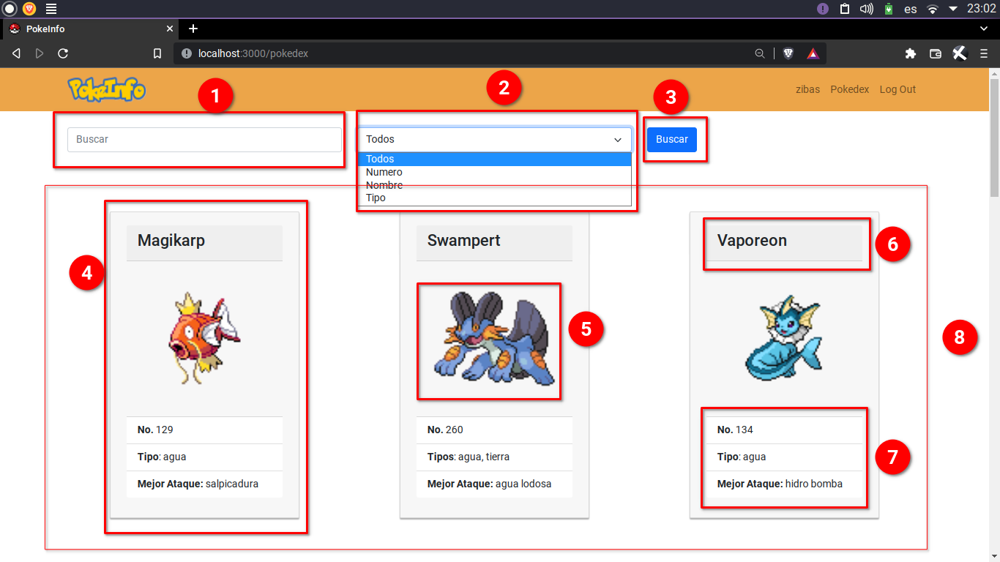

# PokeInfo

Frontend y Backend para una pokedex con la capacidad de gestionar usuarios

<a href="#tabla-de-datos">Tabla de Datos</a>

  

    <a href="#backend">Backend</a>
  

* [Endpoints](#endpoints) 
  * [/](#/) 
  * [/api/auth/login](#/api/auth/login) 
  * [/api/users/test](#/api/users/test) 
  * [/api/users/all](#/api/users/all) 
  * [/api/pokemon/](#/api/pokemon/) 
  * [/api/pokemon/id/:id](#/api/pokemon/id/:id) 
  * [/api/pokemon/name/:name](#/api/pokemon/name/:name) 
  * [/api/pokemon/type/:type](#/api/pokemon/type/:type) 
  * [/api/pokemon/all/:param](#/api/pokemon/all/:param) 
  
* [Configuración](#configuración) 
  * [Cambiar Puerto](#cambiar-puerto) 
  * [Cambiar firma del JWT](#cambiar-firma-del-jwt) 

* [Dependencias](#dependecias) 
  * [Dependencias de desarrollo](#dependecias-de-desarrollo) 

  

    <a href="#frontend">Frontend</a>
  

* [Manual de uso](#manual-de-uso) 
  * [Página principal](#página-principal) 
  * [Log in](#log-in) 
  * [Barra de navegación con usuario ingresado](#barra-de-navegación-con-usuario-ingresado) 
  * [Página de usuario](#página-de-usuario) 
  * [Pokedex](#pokedex) 
    * [Por defecto](#por-defecto) 
    * [Por tipo](#por-tipo) 
    
* [React](#react) 
  * [Dependencias](#dependecias-de-react) 
  
* [Configuración](#configuración-de-react) 
  * [Cambiar Puerto](#puerto) 
  * [Cambiar Puerto del servidor](#puerto-de-la-api) 

## Tabla de datos

|Nombre|Datos|
|------|-----|
|Sebastian Alejandro Vásquez Cartagena| 202109114 |
|Hector Josue Orozco Salazar| Sección B|

# Backend

El Backend se realizó como una REST API en Nodejs. 
Es necesario tener Nodejs instalado en el sistema para poder correr el servidor.
Para correr el servidor ingresar a la carpeta llamada "server" y ejecutar el comando `npm install` para instalar todas las [dependencias](#dependecias).
 
De no dar una configuración específica el servidor correrá por defecto en el puerto 5000.

### Comprobar que la API funciona correctamente
En el navegador escribir `http://localhost:5000/` de funcionar se obtendrá un pequeño mensaje de bienvenida formateado en html.

## Endpoints

La API es capaz de obtener pokemons de la base de datos, loguear usuarios y autenticarlos por medio de los distintos endpoints especificados a continuación.

### `/`
Este endpoint utiliza el metodo `get`, devuelve un mensaje formateado en html que confirma la API esté funcionando

### `/api/auth/login`
Este endpoint utiliza un método `post`. recibe un Json formateado con username, password. Este comprueba que el usuario y contraseña pertenezca a algún usuario en la base de datos. De encontrarlos devuelve el username, avatar y token del usuario. De lo contrario solo se devuelve un código con un mensaje de error.

### `/api/users/test`
Utiliza un método `get`, este endpoint requiere de que el token del usuario ingresado sea enviado por medio de los encabezados de la request. De ser exitosa la comprobación del token devuelve un código 200 con un mensaje de confirmación, de haber ocurrido algún error devuelve un código de error 403 si no se envió un token y otro código 401 si el token fue rechazado.

### `/api/users/all`
Utiliza un método `get` y por seguridad requiere un token válido en el encabezado para devolver todos los usuarios en la base de datos con su respectiva información personal.

### `/api/pokemon/`
Con un método `get` devuelve todos los pokemones en la base de datos en formato Json.

### `/api/pokemon/id/:id`
Método `get` el id del pokemon se obtiene como parte de la url. Y devuelve el pokemon encontrado en la base de datos en formato Json.

### `/api/pokemon/name/:name`
Método `get` el nombre del pokemon se obtiene como parte de la url. Y devuelve el pokemon encontrado en la base de datos en formato Json.

### `/api/pokemon/type/:type`
Método `get` el tipo de los pokemons se obtiene como parte de la url. Y devuelve los pokemons encontrados en la base de datos en unalista de objetos Json.

### `/api/pokemon/all/:param`
Método `get` el parametro de búsqueda "global" se obtiene como parte de la url. Y devuelve los pokemons encontrados en la base de datos en una lista de objetos Json.

## Configuración

### Cambiar Puerto
Para cambiar el puesto en el que corre el servidor es necesario crear una variable global en la terminal llamada SERVPORT y asignarla a cualquier valor que se requiera.

* **Bash, Zsh** `$ export SERVPORT=5001`

* **Fish** `$ set -x SERVPORT 5001`

* **CMD** `set SERVPORT=5001`

* **Powershell** `$env:SERVPORT = 5001`

### Cambiar firma del JWT
Si se desea alargar o acortar el "secreto" del servido para generar token jwt existe un archivo llamado .env en la carpeta backend. En el que se puede configurar el token secreto del servidor.

## Dependencias 

* **bcryp**: Librería utilizada para encriptar y desencriptar contraseñas en la base de datos
* **cors**: Librería para permitir la conexión con otros dominios.
* **dotenv**: Librería para habilitar la configuración global con un archivo .env
* **express**: Librería para gestionar de forma sensilla los endpoints de la API.
* **jsonwebtoken**: Para permitir la autenticación de usuarios logueados con una cookie almacenada en el navegador

### Dependencias de desarrollo

* **morgan**: reinicia el servidor cuando se realiza un cambio en este.

# Frontend
El Frontend se realizó con el apoyo de la tecnología React.
Para correr el servidor del frontend escribir en la terminal `npm start` por defecto el servidor correrá en el puerto 3000, para acceder desde el navegador escribir `http://localhost:3000/`
 

El proyecto se creó con el comando `npx create-react-app .` el cual configura de forma automática un proyecto en react además instala varias [dependencias](#dependencias-de-react) escenciales para usar react.

## Manual de uso

### Página principal

* **1** : url de la página actual.
* **2** : Opción de Log In para redirigirse a la página de Login
* **3** : Logo de la página, al clickarlo redirige a la página principal.
* **4** : Contenido de la página principal de la app.

### Log in

* **1** : Campo de texto para ingresar el usuario
* **2** : Campo de contraseña
* **3** : Botón para enviar y comprobar los datos escritos

### Barra de navegación con usuario ingresado

* **1** : Muestra el nombre de usuario, y si se le da click se redirige a la página de información de usuario
* **2** : Redirige a la página de la pokedex
* **3** : Cierra la sesión del usuario actual.

### Página de usuario

* **1** : Sprite del usuario ingresado 
* **2** : Nombre de usuario
* **3** : token JWT con el cual se autentica este usuario

### Pokedex

#### Por defecto

* **1** : Cuadro de texto donde se ingresa el criterio a buscar
* **2** : Menu de selección para elegir el filtro para buscar
* **3** : Botón para solicitar el criterio de búsqueda con el filtro
* **4** : Tarjeta pokemon donde se muestra la información del pokemon
* **5** : Sprite del pokemon dentro de la tarjeta
* **6** : Nombre del pokemon
* **7** : Lista de información del pokemon
* **8** : Sección donde se muestran todos los pokemon encontrados bajo el criterio de búsqueda.

#### Por tipo

* **2** : Si se especifica que el filtro sea por tipo, entonces el contenedor de las tarjetas pokemon cambiara a un color que represente el tipo especificado.

## React
React es una libreria para JavaScript que facilita el trabajo de crear interfaces de usuario. Se gestiona por medio de "componentes", lo que permite mantener de forma ordenada pequeñas piezas de código y así crear interfaces complejas.
 
React usa una extensión de sitaxis llamada JSX, que permite crear mezclar de forma
explícita la lógica de renderización con la lógica de la interfaz de usuario. 

### Dependencias de React

* **bootstrap** : Permite agregar el css de bootstrap a los componentes de React
* **react-bootstrap** : Agrega componentes ya con el estilo de bootstrap 
* **react-router-dom** : Permite crear diferentes rutas a diferentes páginas dentro de la apliación de React
* **axios** : Facilita la conexión a la API con un cliente HTTP basado en promesas (promises)
* **ract-validation** : Provee de una forma sensilla de validar formularios.

 

El resto de dependencias fueron instaladas de forma automática por `create-react-app`

## Configuración de React

### Puerto
Por defecto el servidor de React se colocará en el puerto 3000 si se desea cambiar de puerto se debe de crear una variable global en la terminal llamada `PORT` como se muestra a continuación.

* **Bash, Zsh** `$ export PORT=3001`

* **Fish** `$ set -x PORT 3001`

* **CMD** `set PORT=3001`

* **Powershell** `$env:PORT = 3001`

### Puerto de la API
El puerto en el que la API correrá también puede ser variable, por lo que se debe de especificar para la app de React. Para establecer una variable global que la pueda interpretar react es necesario llamarla `REACT_APP_SERVPORT`. como se muestra a continuación.

* **Bash, Zsh** `$ export REACT_APP_SERVPORT=5001`

* **Fish** `$ set -x REACT_APP_SERVPORT 5001`

* **CMD** `set REACT_APP_SERVPORT=5001`

* **Powershell** `$env:REACT_APP_SERVPORT = 5001`
